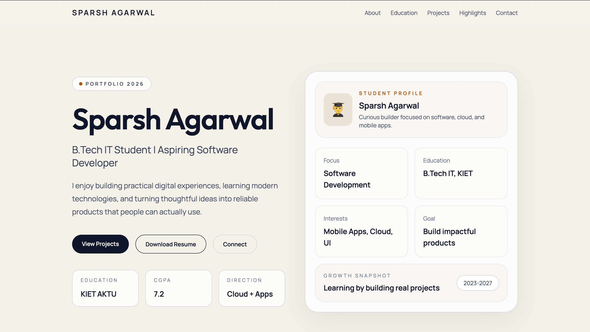
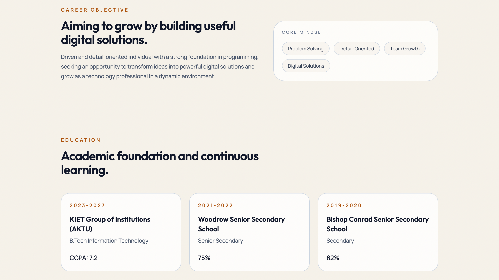
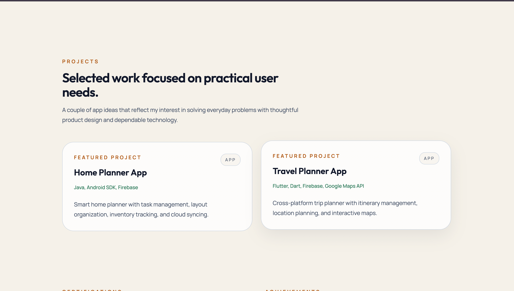
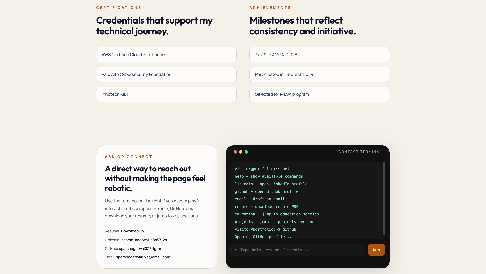
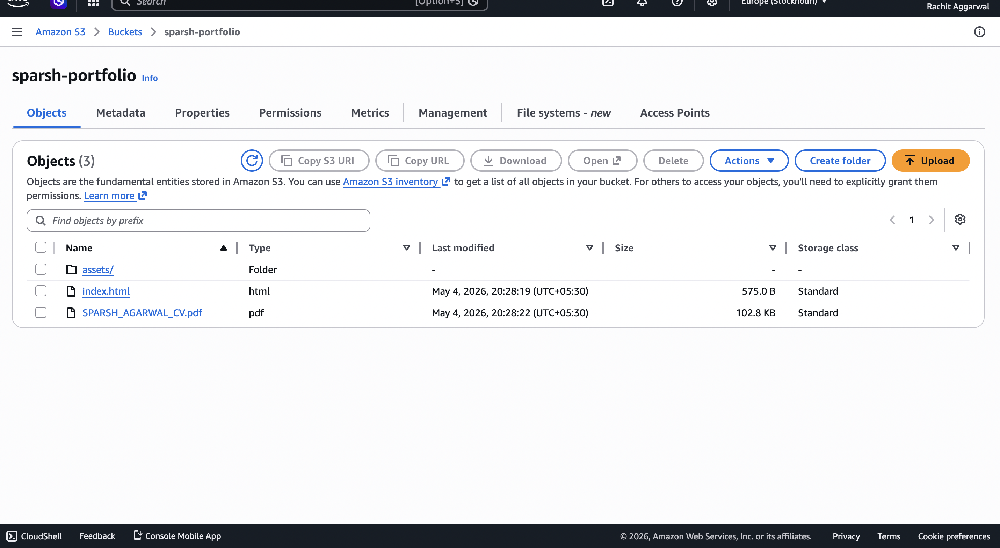
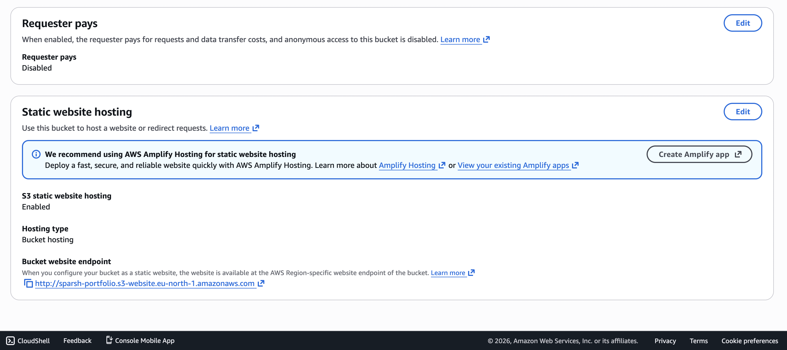
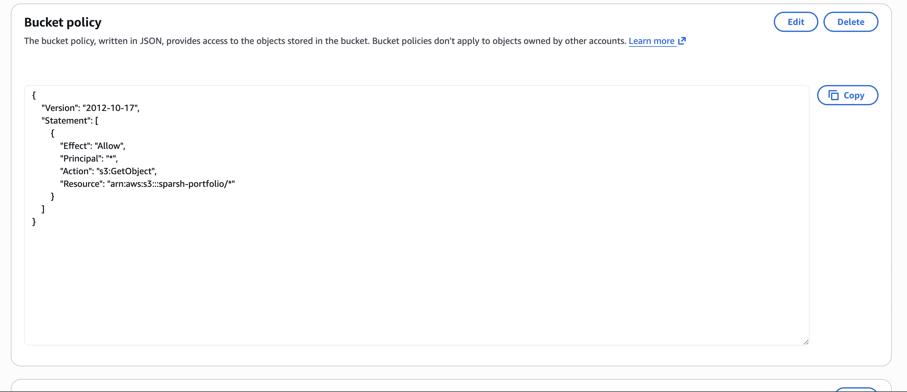

# Sparsh Agarwal Portfolio

Single-page portfolio website built with Vite, React, and Tailwind CSS to showcase education, projects, certifications, achievements, and a simple cloud-hosting direction.

## Overview

This project is designed as a personal portfolio for academic and professional presentation. It includes:

- Hero section with introduction and resume download
- Career objective
- Education section
- Project cards
- Certifications and achievements
- Contact section with a terminal-style interaction panel

## Live Demo

- AWS S3 Hosted Portfolio: http://sparsh-portfolio.s3-website.eu-north-1.amazonaws.com/
- Vercel Hosted Portfolio: https://sparsh-portfolio-zeta.vercel.app/

Note: This live deployment may be removed in the future to avoid unnecessary AWS billing charges. If the link is unavailable, the full source code and project assets are still available in this repository.

## References

### Portfolio Screenshots

#### Home Section



#### Objective and Education Section



#### Projects Section



#### Certifications, Achievements, and Contact Section



### AWS S3 Console Screenshots

#### Bucket Objects



#### Static Website Hosting



#### Bucket Policy



## Tech Stack

- Vite
- React
- Tailwind CSS

## AWS Showcase Idea

This portfolio pairs well with simple AWS services:

- `Amazon S3` for storing static assets such as the resume PDF and project screenshots
- `Amazon S3 Static Website Hosting` for hosting the built portfolio

Optional upgrade:

- `Amazon CloudFront` for CDN delivery of the S3-hosted website and assets

Explanation:

`This portfolio was built using React, Vite, and Tailwind CSS. AWS S3 can be used to host the static website and store assets such as the resume PDF and screenshots.`

## Resume

The resume file is included in:

- `public/SPARSH_AGARWAL_CV.pdf`

The website includes a direct download button for it.

## Getting Started

1. Install dependencies

```bash
npm install
```

2. Start the development server

```bash
npm run dev
```

3. Create a production build

```bash
npm run build
```

4. Preview the production build locally

```bash
npm run preview
```

## Scripts

- `npm run dev` starts the Vite development server
- `npm run build` creates the production build
- `npm run preview` previews the production build locally

## Project Structure

```text
.
├── public/
│   ├── screenshots/
│   │   ├── aws-s3-bucket-objects.png
│   │   ├── aws-s3-bucket-policy.png
│   │   ├── aws-s3-static-hosting.png
│   │   ├── portfolio-contact.png
│   │   ├── portfolio-home.png
│   │   ├── portfolio-objective-education.png
│   │   └── portfolio-projects.png
│   └── SPARSH_AGARWAL_CV.pdf
├── src/
│   ├── App.jsx
│   ├── index.css
│   └── main.jsx
├── index.html
├── package.json
└── README.md
```


